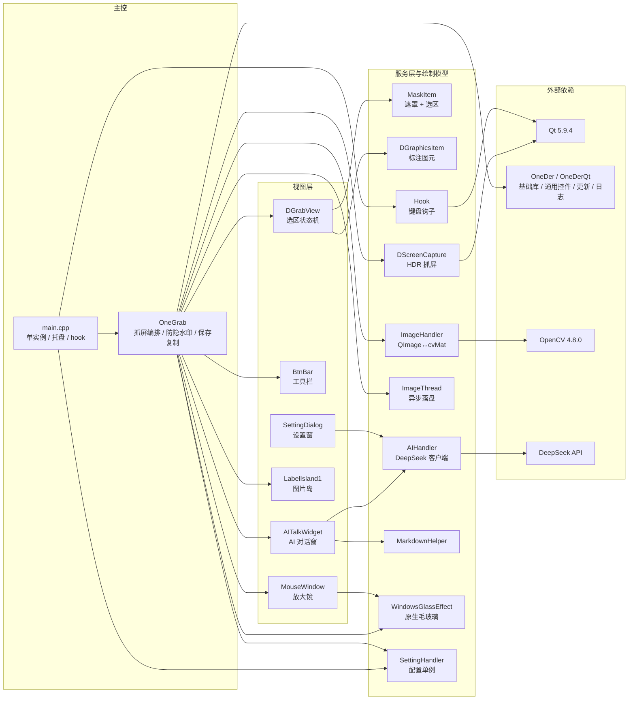

# OneGrab


> **OneGrab 是一个把「截图」变成「提问入口」的 Windows 桌面工具 —— 按 F1 框选屏幕内容，可直接交给多模态大模型看图问答，也能钉成悬浮「图片岛」持续对照。**
>
> 开源、免登录，AI 功能需自备自己的 DeepSeek API Key。

当前版本 `1.4.26.1008` · 分支 `develop` · 仅支持 Windows 10 / 11 (x64)

---

## 这是什么

OneGrab 是一个用 C++ / Qt5 写的 Windows 屏幕截图工具。它的目标不是"再做一个截图软件"，而是把截图之后的那几步动作收进一次按键里：

传统流程是 `截图 → 存文件 → 切到 AI 网站 → 上传图片 → 打字描述问题`；在 OneGrab 里，`F1` 框选之后可以直接在浮层里问 AI，图片以多模态消息随问题一起发给你自己的 API 端点。截图完不想马上用，也可以把它钉成屏幕上的悬浮「图片岛」，一边改界面一边对照参考图。

项目是**个人项目 / 技术验证性质**，不是成熟的商业桌面产品 —— 它在 HDR 抓屏和 Win11 毛玻璃两块啃下了硬骨头。

## 核心功能

### 📸 截图与区域选择

| 能力             | 说明                                                          |
| -------------- | ----------------------------------------------------------- |
| `F1` 全局热键唤起    | 全局低级键盘 hook，不依赖窗口焦点                                         |
| 自由矩形框选         | 支持拖动选区、8 向拖边微调                                              |
| 像素放大镜          | 独立置顶小窗跟随光标显示像素网格，放大倍数可配；边缘/对角线/突然移入均经过专项打磨                  |
| 自动选择窗口         | 启动即自动高亮光标下方窗口，可开关                                           |
| 方向键微调光标        | 逐像素移动，配合放大镜做像素级定位                                           |
| **HDR 屏幕正确抓取** | HDR 输出走 Windows Graphics Capture + FP16，失败自动回退 `grabWindow` |
| 多显示器拼接         | 按 1:1 像素拼接各屏，**未做缩放处理**（见下方注意事项）                            |
| 单实例运行          | 启动时检测，多开时自动退出                                               |

> ⚠️ **多屏缩放比例不一致时选区可能错位**：代码中没有 DPI 缩放换算，多屏是 1:1 像素拼接。若你的主屏与副屏缩放比例不同（如 100% + 150%），选区边界会与图像对不齐。这是当前实现的固有限制，不是配置问题。

### ✏️ 标注绘制

箭头（`A`）、直线（`L`）、矩形（`R`）、自由画笔（`P`）、文字（`W`，自动换行）。线宽 `0`–`4` 切换，其中矩形在 `0` 时为**实心填充**（用于遮挡敏感信息）。`Ctrl+Z` 撤销、`Delete` 删除光标悬停的图元，图元绘制后可拖动、可调整层级。

### 🖼️ 图片岛（悬浮对照）

- 多个悬浮岛并行常驻，以光标为锚点缩放、可拖动；数量上限可在设置中调整（默认 64，可设 1~1024）
- `Shift+F1` 让剪贴板内容直接上岛 —— 支持**三种输入形态**：图片字节、**文件路径字符串**、**网络图片 URL**
- 隐藏后可一键唤回全部已隐藏岛屿（最近隐藏的优先显示），`Ctrl+F1` 快速唤回最近隐藏的一个
- 超出屏幕自动修正位置；右键菜单可隐藏 / 问 AI

### 🤖 AI 看图问答

- 截图浮层内直接唤起 AI 对话，图片作为多模态消息的一部分随问题发送
- 流式回复，思考内容与正文分两块渲染，支持思考模式
- 回答支持 Markdown；复制来的文字 / HTML 可先渲染成图片再发问
- 账户余额查询
- **需自备 DeepSeek API Key**：程序不内置任何 Key，不配置则该功能完全不可用（详见[AI 功能配置](#ai-功能配置)）

### 🛡️ 防隐水印（可选）

三种可独立开关、可叠加的手段，用于破坏隐藏在像素中的水印信息：绕图像中心随机旋转 ±1°、3×3 邻域平均滤波（轮次可调）、逐像素随机噪声。视觉上几乎无变化，轮次越高越模糊。

**三个开关默认全部关闭**，需在设置中手动开启后才会生效。

> ⚠️ **合规提示**：该功能作用于**隐藏在像素中的频域 / 鲁棒水印**，官方描述是「可以一定程度上去除」，**不是**专业取证级水印移除，效果有限。请勿用于侵犯他人著作权或规避版权追踪。

### 📤 截图后处理与 ⚙️ 设置

复制到剪贴板、保存到文件（可选格式与默认路径）、复制到指定路径、取色复制（RGB / HEX 格式切换）；图片处理走后台线程不卡界面；`temp` 临时缓存在每次启动时清空。

设置窗口分四页：**基础 / 高级 / AI / 关于**。含开机自启（以独立小工具实现，避免权限问题）、主题色、放大倍数、快捷键 hook 独占模式、图片岛数量上限、防隐水印三项强度、API Key 与余额、版本检查与自动更新、托盘右键菜单。

**不包含**：滚动长截图、录屏 / GIF、独立 OCR、截图历史管理、云端上传 / 分享链接。

## 技术亮点

以下是源码里真正下了功夫的部分：

**HDR 抓屏走的是「架构性方案」而非「色彩校正」**。先用 DXGI 枚举匹配 `HMONITOR`，只在输出色彩空间等于 `DXGI_COLOR_SPACE_RGB_FULL_G2084_NONE_P2020` 时才走 WGC，用 FP16 帧池抓一帧真实的 scRGB 线性数据。难点在于抓到的 FP16 是线性 scRGB（1.0 = 80 nits），不能直接当 sRGB 用，代码用内嵌 HLSL shader 在 GPU 上完成「除以 SDR 白电平归一化 → 线性转 sRGB」，白电平通过 `QueryDisplayConfig` 逐显示器查询，查不到退回 80 nits。D3D11 设备、着色器、常量缓冲全部进程内单例复用，任何环节失败都静默回退到 `grabWindow`。

**Win11 毛玻璃封装有三级降级，且 API 全部运行时查找**。所有 Win32 API 都走 `GetProcAddress`，绝不直接链接 —— 因为 `SetWindowCompositionAttribute` 是非公开 API，直接引用会因符号缺失而加载失败。降级链是 Win11 22H2+ 原生 Mica/Acrylic → Win10 1803+ Acrylic/Blur → 更老系统 Blur → 只剩自绘 tint。代码不只看 `HRESULT`，还把属性值读回来确认一次才算成功，因为某些系统上 API 会静默拒绝。

**放大镜不是简单地对全图缩放**。那样会在 4K 图上每次鼠标移动都重采样整张图。代码先反算出缩放前的取样区域，只对与原图的交集做裁剪，再把结果贴到预填充为黑色的目标图里 —— 越界部分自然是黑色，不需要写任何边界判断。

## 快捷键

> 以 `OneGrab/src/OneGrab.cpp` 的按键处理为准。两个状态下分别生效：程序在托盘（隐藏）时按下的是全局键，截图浮层激活时按的是编辑键。

**全局（任意状态下可用）**

| 按键             | 功能                                |
| -------------- | --------------------------------- |
| `F1`           | 开始截图                              |
| `Shift` + `F1` | 把剪贴板内容（图片 / 文件路径 / 网络 URL）直接放到图片岛 |
| `Ctrl` + `F1`  | 唤回最近隐藏的图片岛                        |

**截图浮层激活时**

| 按键                          | 功能                     | 备注                         |
| --------------------------- | ---------------------- | -------------------------- |
| `A` / `L` / `R` / `P` / `W` | 箭头 / 直线 / 矩形 / 画笔 / 文字 | `W` 是**画文字**，不是问 AI        |
| `0` – `4`                   | 切换线宽                   | 矩形 + `0` = 实心填充            |
| `C`                         | **复制图片**到剪贴板           | 截图后的主要动作                   |
| `Ctrl` + `C`                | **复制放大镜当前像素的颜色字符串**    | 像素取色，与下一行的 `Shift` 作用于同一个值 |
| `Shift`                     | 切换颜色字符串格式（RGB / HEX）   | 作用于放大镜当前像素的颜色              |
| `S`                         | 保存图片到文件                |                            |
| `T`                         | 定图：把选区固定成图片岛           |                            |
| `Ctrl` + `Z`                | 撤销最后一个图元               |                            |
| `Delete`                    | 删除光标悬停的图元              |                            |
| `↑` `↓` `←` `→`             | 光标逐像素微调                |                            |
| `Esc` / `Q`                 | 取消本次截图                 |                            |

> 「问 AI」**没有快捷键**，请点按钮栏的 AI 按钮，或在图片岛右键菜单里选。

## 快速开始

> ⚠️ **本仓库不是自包含的**。解决方案引用了一个**不在本仓库内**的外部依赖仓库，直接 clone 下来是编不过的 —— 这一步是新手最大的门槛，请务必按顺序操作。

### 依赖清单

| 依赖            | 版本 / 来源                   | 说明                                             |
| ------------- | ------------------------- | ---------------------------------------------- |
| Windows       | 10 / 11 (x64)             | 仅 Windows，无跨平台分支                               |
| 运行权限          | **无需管理员权限**               | 直接运行 `OneGrab.exe` 即可；开机自启以独立小工具实现，不要求提权       |
| 语言标准          | **C++17**                 | 工程设置为 `stdcpp17`                               |
| Visual Studio | **2017（15.9，工具集 v141）**   | 需安装「使用 C++ 的桌面开发」工作负载                          |
| Windows SDK   | **10.0.19041.0**          | 提供 D3D11 / DXGI / WinRT                        |
| Qt            | **5.9.4 MSVC2017 64-bit** | 需含 `core / gui / network / svg / widgets` 五个模块 |
| OpenCV        | 4.8.0                     | **仓库已内置**，无需另外安装                               |
| **OneDer**    | 外部仓库，见下                   | ⚠️ 必须单独 clone                                  |

### 第一步：clone 两个仓库（顺序有讲究）

工程文件里写的是 `..\..\OneDer\...`，即**两个仓库必须是同级目录**，名字也要一致：

```bash
#1. 克隆主仓库
git clone https://gitee.com/dress_a/one-grab.git
cd one-grab
git checkout develop          # develop 才是当前开发分支，master 停留在 0.0.1

#2. 回到上级目录，克隆外部依赖，让它和 one-grab 并排
cd ..
git clone https://gitee.com/dress_a/one-der.git OneDer
```

最终目录结构必须是：

```
<你的目录>\
├── one-grab\        ← 本仓库
└── OneDer\          ← 外部依赖，必须与 one-grab 同级
```

> 解决方案里还引用了 `..\StartByPC`（开机自启小工具）和 `..\OneUpdater`（自更新解包）两个外部工程。它们不是编译主程序的必需项，打开解决方案时 Visual Studio 会提示这两个项目加载失败，**可以忽略**。

### 第二步：配置 Qt

在 VS 的「扩展 → Qt VS Tools → Qt Versions」里注册你安装的 Qt 5.9.4 64 位版本，**名字必须命名为 `qt5.9.4-msvc2017-x64`** —— 工程文件是按这个名字引用的，名字对不上就去 Qt VS Tools 里改工程属性。

OpenCV 无需任何操作，Release 会链接仓库内置的 `OpenCV/lib/opencv_world480.lib`。

### 第三步：编译

1. 用 VS 2017 打开 `OneGrab.sln`
2. 配置管理器选 **`Release | x64`**（工程只定义了 x64 平台）
3. 右键 `OneGrab` 项目 → 生成（只生成主程序即可）
4. 输出位于 `x64\Release\OneGrab.exe`

命令行等价：

```bash
msbuild OneGrab.sln /p:Configuration=Release /p:Platform=x64
```

> ⚠️ **`Debug` 配置不可用**：工程定义了 `Debug|x64` 但缺 OpenCV 的 include / lib 配置，且 Qt 模块缺 `network`，编不过。**Release 是唯一可用的配置。**

### 第四步：运行依赖

从源码构建后，运行时目录 `x64\Release\` 需要具备下列文件才能正常启动：

| 文件                            | 说明                                    |
| ----------------------------- | ------------------------------------- |
| `platforms\qwindows.dll`      | Qt 平台插件，**缺失则程序无法启动**                 |
| `Qt5Core/Gui/Svg/Widgets.dll` | Qt 运行库（仓库未跟踪，需从你的 Qt 安装目录拷贝）          |
| `iconengines\qsvgicon.dll`    | SVG 图标渲染引擎（渲染 `res\svgs\*.svg`）       |
| `imageformats\*.dll`          | 图像格式插件（读取 jpeg/gif/webp 等，保存 PNG 不需要） |
| `OneDerQt.dll`                | 外部依赖 OneDer 的运行库，由 OneDer 仓库提供        |
| `opencv_world480.dll`         | OpenCV 运行库，**仓库已跟踪**                  |
| `StartByPC.exe`               | 开机自启辅助程序，未跟踪                          |
| `updater\` 整目录                | 自更新子进程及其独立 Qt 运行库                     |

> ⚠️ **本仓库暂不提供开箱即用的安装包**。安装包脚本 `CreateInstaller.nsi` **已纳入版本管理**，但它是 NSIS 向导生成的模板，**仍需按项目实际情况调整后方可使用**：产品名还叫 `AA`、版本号写的是 `2.8`、注册表指向 `RegularParse.exe`、安装目录硬编码了开发者本机路径、打包列表里没有 Qt 运行库和 OpenCV，打出来的包装完是跑不起来的。

## AI 功能配置

⚠️ **前置条件：必须先配置自己的 DeepSeek API Key，否则 AI 功能完全不可用。** 程序**不内置任何 Key**，也不会代你申请 —— 未配置时点击「问 AI」只会提示「未设置 Api Key」并直接返回，不会发出任何网络请求。

1. 打开设置（托盘右键菜单 → 设置）→ **AI 设置** 页
2. 填入你的 [DeepSeek API Key](https://platform.deepseek.com/)，点「余额」可验证是否连通并查看余额
3. 完成。之后在截图浮层里点 AI 按钮，或在图片岛右键菜单里选「问 AI」，即可带着截图提问

| 项    | 值                                                     |
| ---- | ----------------------------------------------------- |
| 接口地址 | `https://api.deepseek.com/v1`（OpenAI 兼容协议）            |
| 模型   | `deepseek-flash`（DeepSeek-V4.1-Flash，原生多模态、支持视觉输入）    |
| 思考模式 | 可开关，开启后思考内容与正文分两块显示                                   |
| 图像输入 | 以 `image_url` 块随消息发送，支持 http(s) URL 与 base64 data URL |

**几点需要知道的：**

- **调用费用由你的 DeepSeek 账户承担**，OneGrab 不代付、不代理充值，只做直连。
- **模型当前固定为 `deepseek-flash`，界面上无法切换**，后续版本计划开放模型选择（见本节末「路线图」）；思考强度同理（在代码中固定为 `max`）。`max_tokens` 的调用代码目前处于注释状态，因此**实际不可调**。
- **隐私边界**：
  - **默认状态**：OneGrab 不会主动上传任何屏幕内容。
  - **使用 AI 功能时**：截图内容会作为 `image_url` 块随请求发送到你填写的 API 端点（默认 `https://api.deepseek.com/v1`）。这是**你主动触发的功能**，不是后台行为。
  - **除AI 调用外的唯一外联**：启动时向 Gitee 查询版本更新，可在设置中关闭「启动时检查更新」。该更新走 Gitee 公开匿名接口、不携带凭据；经核查更新组件与依赖库中不含任何设备标识采集代码（无机器名、用户名、硬盘序列号、网卡 MAC 等指纹采集）。
- **日志会落盘**：项目自 v1.4.x 起内置日志系统，按天写入程序目录下的 `logs/` 文件夹。落盘内容为调试与运行信息（包含截图选区的坐标与尺寸等界面状态），**不含 API Key，也不含屏幕图像**。另请注意 API Key 是**明文存盘**在本地配置文件里（无加密保护），共用电脑请留意。
- AI 对话**没有会话管理**，消息会无限累积并每轮全量重发，长对话可能变慢或超限。

**路线图**：后续版本计划开放 **AI 模型可选** —— 当前 `deepseek-flash` 为固定值，届时可在设置中切换模型。

## 项目结构

```
OneGrab/
├── OneGrab.sln                   # VS2017 解决方案
├── CreateInstaller.nsi           # NSIS 安装包脚本（已纳入仓库，仍需配置后方可使用）
├── LICENSE                       # GPL v3
│
├── OpenCV/                       # 【仓库内置】OpenCV 4.8 头文件与库
│   ├── include/opencv2/
│   └── lib/opencv_world480.lib
│
├── OneGrab/                      # 主工程
│   ├── OneGrab.vcxproj
│   └── res/                      # 资源：15 个 SVG 图标 + res.qrc
│       └── src/                  # 全部业务源码
│           ├── main.cpp              # 入口：单实例 → 托盘 → hook → 装配
│           ├── OneGrab.{h,cpp}       # 主控：抓屏编排、防隐水印、保存/复制、问 AI
│           ├── DScreenCapture.{h,cpp}# HDR 抓屏：WGC + D3D11 FP16 + GPU tone map
│           ├── DGrabView.{h,cpp}     # 选区状态机、窗口吸附、绘图派发
│           ├── MaskItem.{h,cpp}      # 遮罩 + 选区边框绘制
│           ├── DGraphicsItem.h       # 6 种标注图元（矩形/直线/箭头/折线/椭圆/文字）
│           ├── BtnBar.{h,cpp}        # 底部工具栏
│           ├── MouseWindow.{h,cpp}   # 鼠标放大镜
│           ├── LabelIsland1.{h,cpp}    # 图片岛（唯一在用）
│           ├── LabelIsland2~5.{h,cpp}  # 历史遗留方案，未接入
│           ├── AIHandler.{h,cpp}     # DeepSeek 客户端：HTTP + SSE + 余额查询
│           ├── AITalkWidget.{h,cpp}  # AI 对话窗
│           ├── MarkdownHelper.{h,cpp}# Markdown → HTML
│           ├── WindowsGlassEffect.{h,cpp} # 原生毛玻璃封装（三级降级）
│           ├── ImageHandler.{h,cpp}  # QImage ↔ cv::Mat 转换
│           ├── ImageThread.{h,cpp}   # 图片保存后台线程
│           ├── SettingHandler.{h,cpp}# 配置单例（读写锁 + JSON）
│           ├── SettingDialog.{h,cpp} # 设置窗（4 个分页）
│           ├── hook.{h,cpp}          # 全局低级键盘钩子
│           └── version.h             # 版本号
│
└── x64/Release/                  # 运行目录
```

模块之间的依赖关系（`OneDer` 与 Qt 折叠在一起以突出主线）：



## 许可证

本项目采用 [GNU General Public License v3](LICENSE) 开源：你可以自由地使用、学习、修改和再分发，但衍生作品同样必须以 GPL-3.0 发布，且分发时需附带许可证与源码。

## 说明

- 界面采用 Windows 11 的 Mica / Acrylic 毛玻璃风格，由项目内自研的 `WindowsGlassEffect` 实现（封装了非公开 API，通过运行时动态查找调用）。
- AI 能力由 DeepSeek 官方 API 提供，需自行申请 Key 并承担调用费用；模型名称与 API 参数可能随服务方调整而变化。
- 本项目仅供学习与个人使用，请在合法合规的前提下使用「防隐水印」功能。

---

*文档基于 `develop` 分支 HEAD `7895dc0`（版本 `1.4.26.1008`）撰写。功能描述均以源码与提交记录为依据；如发现文档与代码不一致，以代码为准，欢迎提 Issue 修正。*
