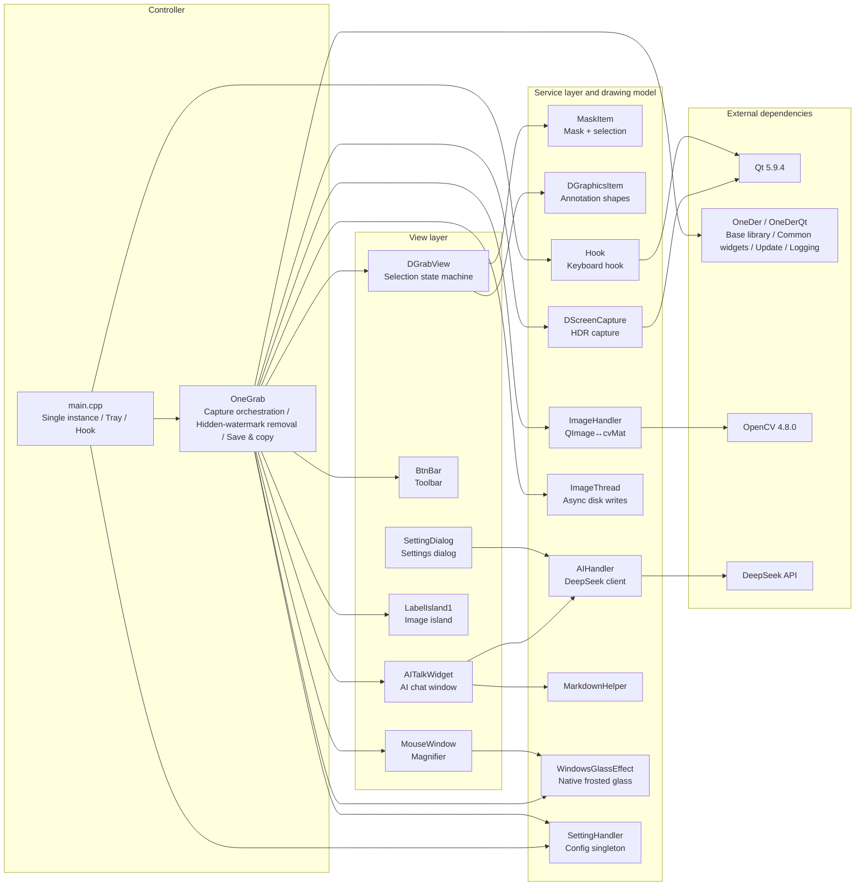

# OneGrab


[简体中文 / Chinese version](README.md)

> **OneGrab is a Windows desktop tool that turns "taking a screenshot" into "asking a question" — press F1 to select a region of the screen, send it straight to a multimodal LLM for visual Q&A, or pin it as a floating "image island" and keep it beside you.**
>
> Open source, no login required — the AI features require **your own DeepSeek API Key**. When you don't use the AI features, no screen content leaves your machine.

Current version `1.4.26.1008` · branch `develop` · Windows 10 / 11 (x64) only

---

## What Is This

OneGrab is a Windows screen capture tool written in C++ / Qt5. Its goal is not "to build yet another screenshot app", but to fold the steps that come *after* a screenshot into a single keystroke:

The traditional flow is `screenshot → save file → switch to an AI website → upload the image → type your question`. In OneGrab, after you select a region with `F1` you can ask the AI right inside the overlay — the image goes out as a multimodal message together with your question, to your own API endpoint. And if you don't want to use it right away, you can pin it as a floating "image island" on screen and consult it while you work on something else.

This is a **personal / technical-validation project**, not a mature commercial desktop product. What it does take seriously is the hard part of the problem: HDR screen capture and Win11 frosted glass.

## Core Features

### 📸 Screenshots and Region Selection

| Capability                    | Description                                                                                        |
| ----------------------------- | -------------------------------------------------------------------------------------------------- |
| `F1` global hotkey            | Global low-level keyboard hook; does not depend on window focus                                     |
| Free rectangular selection    | Drag out a region, resize from any of 8 handles                                                    |
| Pixel magnifier               | Separate always-on-top mini window following the cursor, showing a pixel grid; magnification is configurable; edge, diagonal, and sudden-move-in behaviors were each specifically polished |
| Auto window selection         | The window under the cursor is highlighted automatically on activation; can be turned off            |
| Arrow-key cursor nudge        | Move the cursor one pixel at a time, for pixel-level positioning together with the magnifier        |
| **Correct HDR capture**       | HDR output goes through Windows Graphics Capture + FP16, falling back to `grabWindow` automatically |
| Multi-monitor stitching       | Screens are stitched at a 1:1 pixel ratio, **with no scaling compensation** (see the note below)      |
| Single instance               | Detected at launch; extra instances exit automatically                                              |

> ⚠️ **When monitors use different scaling ratios, the selection may be misaligned**: there is no DPI scaling conversion in the code, and multi-monitor capture is stitched 1:1. If your primary and secondary monitors use different scale factors (e.g. 100% + 150%), the selection bounds will not line up with the captured image. This is inherent to the current implementation, not a configuration problem.

### ✏️ Annotation Drawing

Arrow (`A`), line (`L`), rectangle (`R`), freehand pen (`P`), and text (`W`, with automatic word wrap). Line width toggles through `0`–`4`; at `0` the rectangle becomes a **solid fill** (handy for masking sensitive information). `Ctrl+Z` undoes, `Delete` removes the shape under the cursor, and shapes can be dragged and re-layered after drawing.

### 🖼️ Image Island (Floating Reference)

- Multiple floating islands live side by side, scaling around the cursor as an anchor and freely draggable; the maximum count is configurable (default 64, settable from 1 to 1024)
- `Shift+F1` sends clipboard content straight onto an island — **three input forms** are supported: image bytes, **a file path string**, and **an image URL**
- After hiding, bring back every hidden island in one click (the most recently hidden comes first); `Ctrl+F1` quickly restores the single most recently hidden island
- Islands that fall outside the screen are repositioned automatically; the right-click menu offers 隐藏（Hide）and 问 AI（Ask AI）

### 🤖 AI Visual Q&A

- Invoke the AI chat directly inside the capture overlay; the image is sent along with your question as part of a multimodal message
- Streaming responses, with the thinking content and the body rendered as two separate blocks; thinking mode is supported
- Answers support Markdown; copied text or HTML can be rendered into an image first and then asked about
- Account balance query
- **Requires your own DeepSeek API Key**: the app ships with no key at all, and without one this feature is completely unavailable (see [AI Configuration](#ai-configuration))

### 🛡️ Hidden-Watermark Removal (Optional)

Three independently switchable, stackable techniques that work by disrupting watermark information hidden inside the pixels: random rotation of ±1° about the image center, 3×3 neighborhood mean filtering (round count adjustable), and per-pixel random noise. The result looks almost unchanged, and blurs progressively the more rounds you apply.

**All three switches are off by default** — you must turn them on manually in settings before they take effect.

> ⚠️ **Compliance notice**: this feature targets **frequency-domain / robust watermarks hidden in the pixels**, and the official description is that it "can be removed to some extent" — it is **not** forensic-grade watermark removal, and the result is limited. Do not use it to infringe others' copyright or to evade copyright tracking.

### 📤 Post-Capture Actions & ⚙️ Settings

Copy to clipboard, save to file (format and default path configurable), copy to a chosen path, and color-picker copy (switchable between RGB / HEX); image processing runs on a background thread so the UI never blocks; the `temp` cache is cleared on every launch.

The settings window has four pages: **基础设置（Basic Settings）** / **高级设置（Advanced Settings）** / **AI设置（AI Settings）** / **关于OneGrab（About OneGrab）**. It covers launch-on-startup (implemented as a separate small utility to avoid permission issues), theme color, magnification, hotkey hook exclusive mode, image island count limit, the three hidden-watermark strengths, API Key and balance, version check and auto-update, and the tray right-click menu.

**Not included**: scrolling long screenshots, screen recording / GIF, standalone OCR, screenshot history management, cloud upload / share links.

## Technical Highlights

These are the parts of the source code where real effort was actually spent:

**HDR capture uses an architectural approach rather than color correction.** It first enumerates displays through DXGI to match `HMONITOR`, and only takes the WGC path when the output color space equals `DXGI_COLOR_SPACE_RGB_FULL_G2084_NONE_P2020`, capturing one frame of genuine scRGB linear data through an FP16 frame pool. The hard part is that the captured FP16 is linear scRGB (1.0 = 80 nits) and cannot be used directly as sRGB, so the code runs an embedded HLSL shader on the GPU to "divide by the SDR white level to normalise → convert linear to sRGB"; the white level is queried per display through `QueryDisplayConfig`, falling back to 80 nits when it cannot be determined. The D3D11 device, shaders, and constant buffers are all reused as in-process singletons, and any failure at any step silently falls back to `grabWindow`.

**The Win11 frosted-glass wrapper has three degradation levels, and every API is looked up at runtime.** All Win32 APIs go through `GetProcAddress` and are never linked directly — because `SetWindowCompositionAttribute` is an undocumented API, and referencing it directly would fail to load on a missing symbol. The fallback chain is native Mica/Acrylic on Win11 22H2+ → Acrylic/Blur on Win10 1803+ → Blur on older systems → a hand-painted tint only. The code does not just check `HRESULT` either; it also reads the property value back and only counts the call as successful once that confirms it, because on some systems the API silently refuses.

**The magnifier does not simply scale the whole image.** Doing that would resample the entire image on every mouse move at 4K. Instead the code back-computes the sample region from before the scaling, crops only the intersection with the original, and pastes the result into a target image pre-filled with black — so the out-of-bounds area is naturally black and no boundary checks are needed.

## Keyboard Shortcuts

> Taken from the key handling in `OneGrab/src/OneGrab.cpp`. The two groups apply in different states: while the app sits in the tray (hidden) the global keys are active; while the capture overlay is active the editing keys are active.

**Global (available in any state)**

| Key             | Action                                                                     |
| --------------- | -------------------------------------------------------------------------- |
| `F1`            | Start a capture                                                            |
| `Shift` + `F1` | Put clipboard content (image / file path / web URL) directly onto an image island |
| `Ctrl` + `F1`  | Restore the most recently hidden image island                              |

**While the capture overlay is active**

| Key                          | Action                                                    | Notes                                              |
| ---------------------------- | --------------------------------------------------------- | -------------------------------------------------- |
| `A` / `L` / `R` / `P` / `W` | Arrow / line / rectangle / pen / text                     | `W` draws **text**, it does not ask the AI          |
| `0` – `4`                   | Switch line width                                         | Rectangle + `0` = solid fill                       |
| `C`                         | **Copy the image** to the clipboard                       | The main action after a capture                    |
| `Ctrl` + `C`                | **Copy the color string of the magnifier's current pixel** | Pixel color picking; acts on the same value as `Shift` below |
| `Shift`                     | Toggle the color string format (RGB / HEX)               | Acts on the magnifier's current pixel color       |
| `S`                         | Save the image to a file                                  |                                                    |
| `T`                         | Pin it: turn the selection into an image island           |                                                    |
| `Ctrl` + `Z`                | Undo the last shape                                       |                                                    |
| `Delete`                    | Delete the shape under the cursor                         |                                                    |
| `↑` `↓` `←` `→`             | Nudge the cursor one pixel at a time                      |                                                    |
| `Esc` / `Q`                 | Cancel this capture                                       |                                                    |

> 问 AI（Ask AI）has **no keyboard shortcut** — click the AI button in the button bar, or pick 问 AI（Ask AI）from an image island's right-click menu.

## UI Language

OneGrab's interface is **Chinese-only** at present. Wherever this document asks you to click something, the on-screen Chinese text is given first, followed by an English gloss in the form **中文原文（English）** — for example: open Settings from the tray right-click menu → 设置（Settings）→ the **AI设置（AI Settings）** page. Keyboard shortcuts are physical key names and are left untranslated.

## Quick Start

> ⚠️ **This repository is not self-contained.** The solution references an **external dependency repository that is not part of this one**, so a plain clone will not build — this is the biggest hurdle for newcomers, so please follow the steps in order.

### Dependency List

| Dependency      | Version / Source              | Notes                                                                               |
| --------------- | ----------------------------- | ----------------------------------------------------------------------------------- |
| Windows         | 10 / 11 (x64)                 | Windows only, no cross-platform branch                                              |
| Runtime rights  | **No administrator rights required** | Just run `OneGrab.exe`; launch-on-startup is a separate small utility and needs no elevation |
| Language standard | **C++17**                   | The project is set to `stdcpp17`                                                    |
| Visual Studio   | **2017 (15.9, toolset v141)** | Install the "Desktop development with C++" workload                                |
| Windows SDK     | **10.0.19041.0**              | Provides D3D11 / DXGI / WinRT                                                       |
| Qt              | **5.9.4 MSVC2017 64-bit**     | Must include the five modules `core / gui / network / svg / widgets`               |
| OpenCV          | 4.8.0                         | **Bundled in this repository**, nothing to install separately                       |
| **OneDer**      | External repository, see below | ⚠️ Must be cloned separately                                                        |

### Step 1: Clone Both Repositories (Order Matters)

The project files reference `..\..\OneDer\...`, i.e. **the two repositories must be siblings**, and the directory names must match exactly:

```bash
#1. Clone the main repository
git clone https://gitee.com/dress_a/one-grab.git
cd one-grab
git checkout develop          # develop is the active development branch; master is stuck at 0.0.1

#2. Go back to the parent directory and clone the external dependency next to one-grab
cd ..
git clone https://gitee.com/dress_a/one-der.git OneDer
```

The final directory structure must be:

```
<your directory>\
├── one-grab\        ← this repository
└── OneDer\          ← external dependency, must be a sibling of one-grab
```

> The solution also references two external projects, `..\StartByPC` (the launch-on-startup utility) and `..\OneUpdater` (the self-update unpacker). They are not required to build the main program; Visual Studio will report that these two projects failed to load when you open the solution, and **you can ignore that**.

### Step 2: Configure Qt

In Visual Studio, open 扩展（Extensions）→ Qt VS Tools → Qt Versions and register your installed 64-bit Qt 5.9.4. **It must be named `qt5.9.4-msvc2017-x64`** — the project files reference it by that exact name, and if the name does not match you have to change the project property inside Qt VS Tools.

OpenCV needs no manual work: Release links against the bundled `OpenCV/lib/opencv_world480.lib`.

### Step 3: Build

1. Open `OneGrab.sln` in VS 2017
2. Set the configuration manager to **`Release | x64`** (the project only defines the x64 platform)
3. Right-click the `OneGrab` project → Build (building the main program alone is enough)
4. The output is at `x64\Release\OneGrab.exe`

Command-line equivalent:

```bash
msbuild OneGrab.sln /p:Configuration=Release /p:Platform=x64
```

> ⚠️ **The `Debug` configuration does not work**: the project defines `Debug|x64` but lacks the OpenCV include / lib configuration, and the Qt module set is missing `network`, so it does not compile. **Release is the only usable configuration.**

### Step 4: Runtime Dependencies

After building from source, the runtime directory `x64\Release\` needs the following files in order to start:

| File                            | Notes                                                                          |
| ------------------------------- | ------------------------------------------------------------------------------ |
| `platforms\qwindows.dll`        | Qt platform plugin, **the app cannot start without it**                        |
| `Qt5Core/Gui/Svg/Widgets.dll`   | Qt runtime libraries (not tracked by the repo; copy them from your Qt install)  |
| `iconengines\qsvgicon.dll`      | SVG icon rendering engine (renders `res\svgs\*.svg`)                            |
| `imageformats\*.dll`            | Image format plugins (reading jpeg/gif/webp etc.; not needed to save PNG)        |
| `OneDerQt.dll`                  | Runtime library of the external dependency OneDer, provided by the OneDer repo  |
| `opencv_world480.dll`           | OpenCV runtime, **tracked by the repo**                                         |
| `StartByPC.exe`                 | Launch-on-startup helper, not tracked                                           |
| `updater\` (whole directory)    | The self-update child process and its own Qt runtime                            |

> ⚠️ **This repository does not ship a ready-to-use installer for now.** The installer script `CreateInstaller.nsi` **is under version control**, but it is a template generated by the NSIS wizard and **still has to be adapted to this project before it can be used**: the product name is still `AA`, the version number says `2.8`, the registry entries point to `RegularParse.exe`, the install directory hardcodes the developer's local path, and the packaging list contains neither the Qt runtime nor OpenCV — a package built from it will not run.

## AI Configuration

⚠️ **Prerequisite: you must configure your own DeepSeek API Key first, otherwise the AI features are completely unavailable.** The app **ships with no key at all** and will not apply for one on your behalf — without a key, clicking 问 AI（Ask AI）only shows 未设置 Api Key（"API Key not set"）and returns immediately, without sending any network request.

1. Open Settings (tray right-click menu → 设置（Settings）) → the **AI设置（AI Settings）** page
2. Paste your [DeepSeek API Key](https://platform.deepseek.com/) and click 余额（Balance）to verify connectivity and check the balance
3. That is all. You can now click the AI button inside the capture overlay, or pick 问 AI（Ask AI）from an image island's right-click menu, and ask a question with your screenshot attached.

| Item           | Value                                                                              |
| -------------- | ---------------------------------------------------------------------------------- |
| Endpoint       | `https://api.deepseek.com/v1` (OpenAI-compatible protocol)                         |
| Model          | `deepseek-flash` (DeepSeek-V4.1-Flash, natively multimodal, supports vision input)  |
| Thinking mode  | Toggleable; when enabled, thinking content and body text are shown in two blocks     |
| Image input    | Sent as an `image_url` block alongside the message; http(s) URLs and base64 data URLs are supported |

**A few things worth knowing:**

- **Call costs are borne by your DeepSeek account.** OneGrab does not pay for you and does not proxy top-ups; it only talks to the endpoint directly.
- **The model is currently fixed to `deepseek-flash` and cannot be switched in the UI**; a future version plans to open up model selection (see "Roadmap" at the end of this section). Thinking effort works the same way (hardcoded to `max` in the code). The `max_tokens` call site is currently commented out, so in practice **it is not adjustable**.
- **Privacy boundary**:
  - **Default state**: OneGrab does not upload any screen content on its own.
  - **When you use the AI features**: the screenshot is sent as an `image_url` block with the request to the API endpoint you filled in (default `https://api.deepseek.com/v1`). This is **a function you trigger yourself**, not background behavior.
  - **The only outbound connection besides AI calls**: at startup it queries Gitee for version updates, which you can disable via 启动时检查更新（Check for updates on startup）in settings. That update check uses Gitee's public anonymous API and carries no credentials; the update component and its dependencies have been checked and contain no device-identifier collection code (no machine name, user name, disk serial number, NIC MAC, or any such fingerprinting).
- **Logs are written to disk**: since v1.4.x the project has a built-in logging system that writes into a `logs/` folder in the program directory, one file per day. What lands on disk is debug and runtime information (including interface state such as the coordinates and size of the selection region), **with no API Key and no screen images**. Note also that the API Key is **stored in plaintext** in the local configuration file (no encryption); be careful on shared machines.
- AI conversations have **no session management** — messages accumulate without bound and are resent in full every turn, so long conversations may get slow or hit limits.

**Roadmap**: a future version plans to make the **AI model selectable** — `deepseek-flash` is fixed today, and later you will be able to switch models in settings.

## Project Structure

```
OneGrab/
├── OneGrab.sln                   # VS2017 solution
├── CreateInstaller.nsi           # NSIS installer script (in the repo, still needs configuration before use)
├── LICENSE                       # GPL v3
│
├── OpenCV/                       # [Bundled in repo] OpenCV 4.8 headers and libs
│   ├── include/opencv2/
│   └── lib/opencv_world480.lib
│
├── OneGrab/                      # main project
│   ├── OneGrab.vcxproj
│   └── res/                      # resources: 15 SVG icons + res.qrc
│       └── src/                  # all application source code
│           ├── main.cpp              # entry: single instance → tray → hook → wiring
│           ├── OneGrab.{h,cpp}       # controller: capture orchestration, hidden-watermark removal, save/copy, ask AI
│           ├── DScreenCapture.{h,cpp}# HDR capture: WGC + D3D11 FP16 + GPU tone map
│           ├── DGrabView.{h,cpp}     # selection state machine, window snapping, draw dispatch
│           ├── MaskItem.{h,cpp}      # mask + selection border painting
│           ├── DGraphicsItem.h       # 6 annotation shapes (rect/line/arrow/polyline/ellipse/text)
│           ├── BtnBar.{h,cpp}        # bottom toolbar
│           ├── MouseWindow.{h,cpp}   # cursor magnifier
│           ├── LabelIsland1.{h,cpp}    # image island (the only one in use)
│           ├── LabelIsland2~5.{h,cpp}  # legacy approach, not wired up
│           ├── AIHandler.{h,cpp}     # DeepSeek client: HTTP + SSE + balance query
│           ├── AITalkWidget.{h,cpp}  # AI chat window
│           ├── MarkdownHelper.{h,cpp}# Markdown → HTML
│           ├── WindowsGlassEffect.{h,cpp} # native frosted glass wrapper (three degradation levels)
│           ├── ImageHandler.{h,cpp}  # QImage ↔ cv::Mat conversion
│           ├── ImageThread.{h,cpp}   # background image-saving thread
│           ├── SettingHandler.{h,cpp}# config singleton (read-write lock + JSON)
│           ├── SettingDialog.{h,cpp} # settings dialog (4 pages)
│           ├── hook.{h,cpp}          # global low-level keyboard hook
│           └── version.h             # version number
│
└── x64/Release/                  # runtime directory
```

Dependency relationships between modules (`OneDer` and Qt are folded together to highlight the main line):



## License

This project is released under the [GNU General Public License v3](LICENSE): you are free to use, study, modify, and redistribute it, but derivative works must also be released under GPL-3.0, and the license and source must be included when you distribute them.

## Notes

- The UI follows the Windows 11 Mica / Acrylic frosted-glass style, implemented by the project's own `WindowsGlassEffect` (it wraps an undocumented API and calls it through runtime dynamic lookup).
- AI capability is provided by DeepSeek's official API; you need to apply for your own key and bear the call costs. The model name and API parameters may change as the service provider adjusts them.
- This project is for study and personal use only. Please use the hidden-watermark removal feature lawfully and in compliance with applicable rules.

---

*This document is based on `develop` HEAD `7895dc0` (version `1.4.26.1008`). Feature descriptions are grounded in the source code and commit history; if the documentation and the code disagree, the code wins — please open an issue to help fix it.*